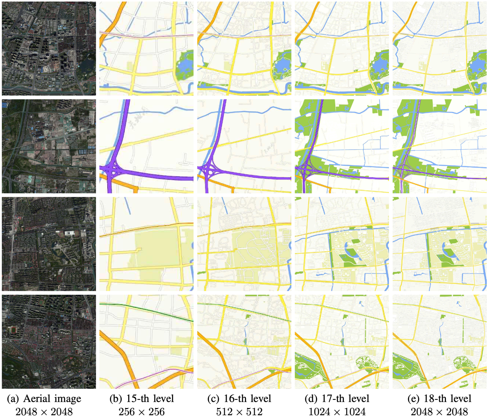

# Multi-Level Map (MLM)

A large scale high quality dataset for map generation at multiple zoom levels.

To develop and evaluate learning-based multi-level map generation methods, the dataset consisting of paired samples of aerial image and map with multiple zoom levels is important. Thus, we collect and produce a large scale high quality Multi-Level Map (MLM) dataset for map generation at multiple zoom levels. The data comes from Google Maps and Tianditu. 

The MLM dataset will be publicly available soon!

